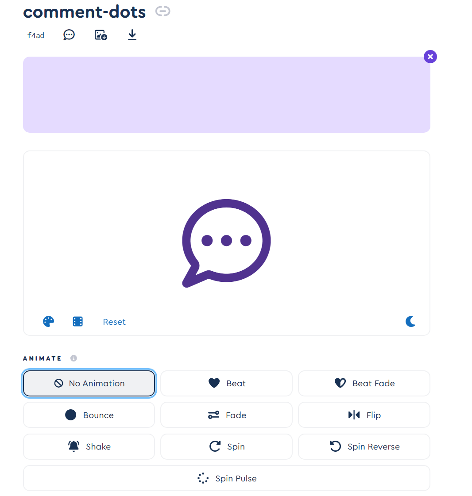
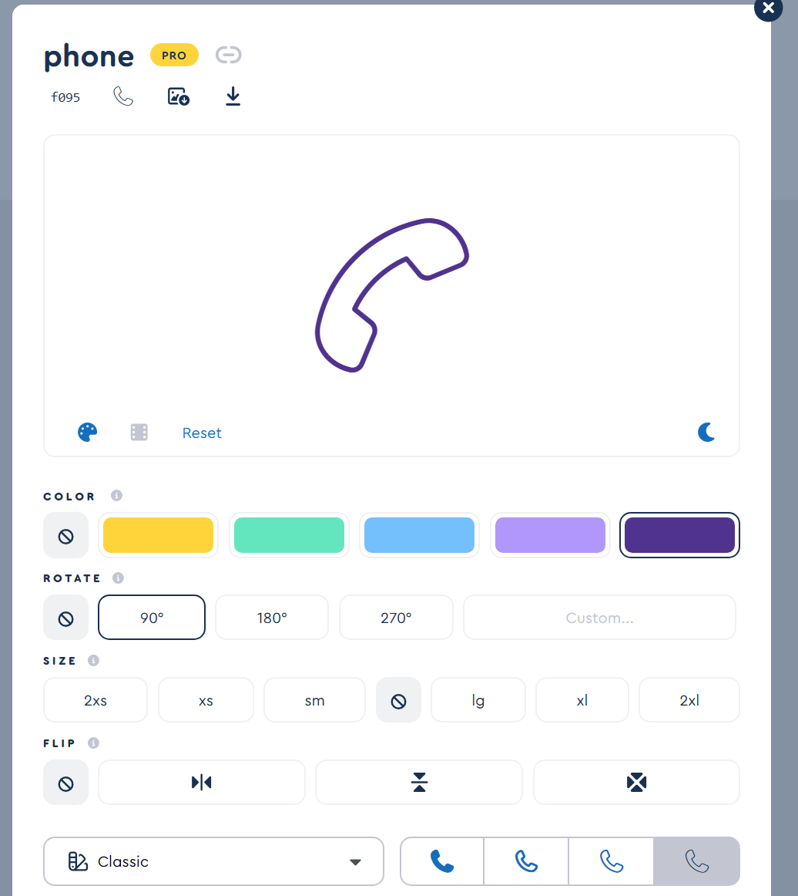

# 引用的图标

## Search

### 搜索

```vue
<font-awesome-icon class="absolute left-4 top-1/2 -translate-y-1/2 h-5 w-5 " icon="fa-solid fa-magnifying-glass " style="color: #9e9e9e;" />

```

## TabBar

### 消息

```vue
<font-awesome-icon icon="fa-regular fa-comment-dots" fade style="color: #50328f;" />
```



### 联系人

```vue
<font-awesome-icon icon="fa-thin fa-phone" rotation=90 style="color: #50328f;" />
```

